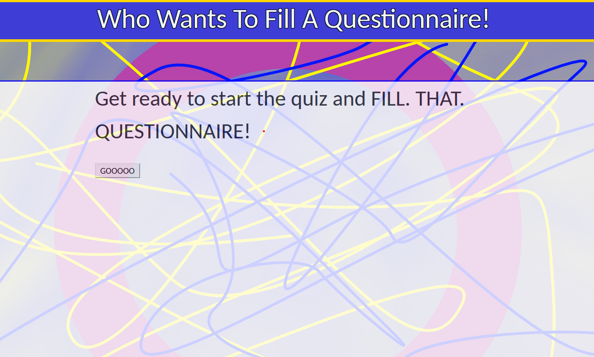
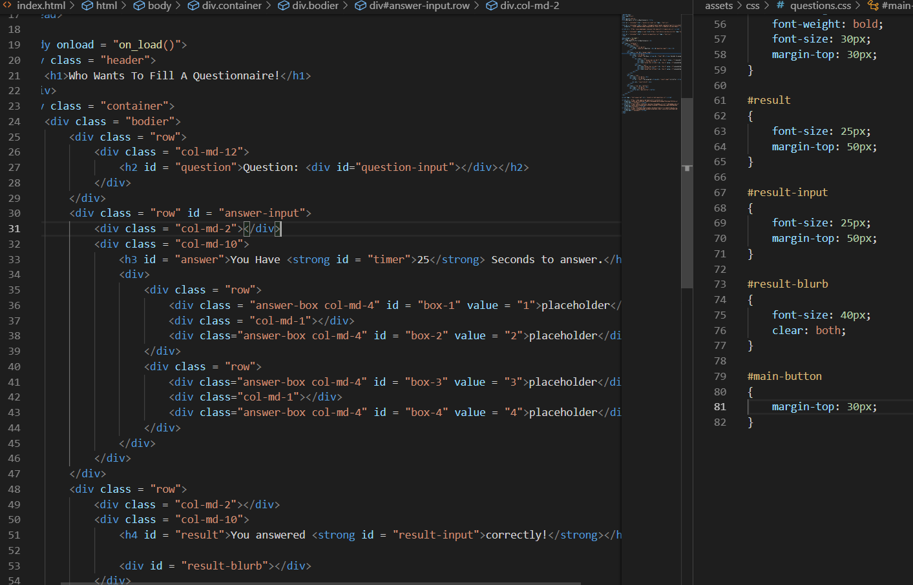
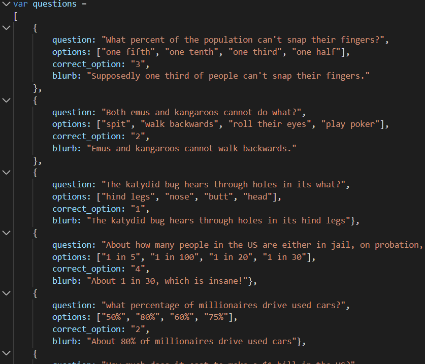
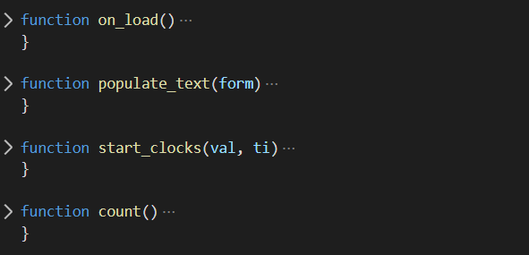
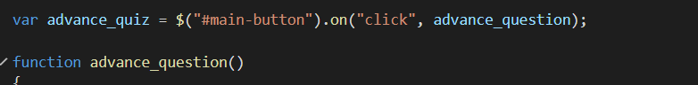
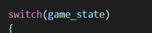
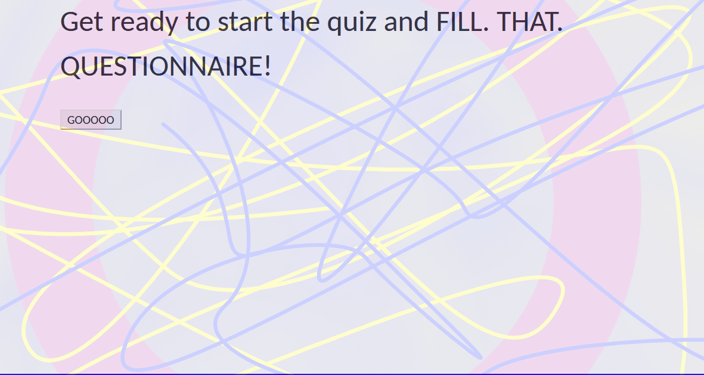

# trivia_game

## Welcome to Who Wants to Fill a Questionnaire!

### The aim of the game is simple! just click the shiny boxes that don't react at all to your touch because they are more stoic than british palace guards and VOILA! you'll get told how slightly uneducated you are!

## if you want to play the game just click the link here https://ametueraspirant.github.io/trivia_game/

I'll be solid this could have been a lot better but I ran out of time for all the cool stuff I wanted to do. you can't see it but trust me it was gonna be super great lots of camera angles and photoshop of the show and all that!

here's some code. there's a lot of code. and I promise I'll get to commenting my stuff at some point in the future.

it's an array of objects with more arrays inside. just sad I couln't think of an excuse to add more objects inside those arrays.

some functions so I can dry myself out more or something

but the real star of the show is this bad boy right here. it does everything almost and nothing could exist without it.

yes it's literally just a giant switch statement that I dumped all of my logic into. I like doing this.

and hey it works!
